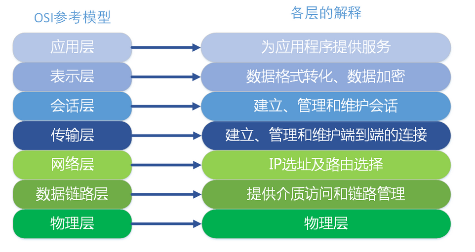

## 计算机网络知识点 
### 冯诺依曼体系结构

1.存储器用来存放数据和程序  
2.运算器主要运行算数运算和逻辑运算，并将中间结果暂存到运算器中  
3.控制器主要用来控制和指挥程序和数据的输入运行，以及处理运算结果  
4.输入设备用来将人们熟悉的信息形式转换为机器能够识别的信息形式，常见的有键盘，鼠标等  
5.输出设备可以将机器运算结果转换为人们熟悉的信息形式，如打印机输出，显示器输出等  
### OSI 7层模型
OSI（Open System Interconnect），即开放式系统互联；

OSI模型与TCP模型的对应关系：

### TCP 5层模型
* 物理层：传输比特流
* 数据链路层：将数据装成帧（差错控制）
* 网络层：将一端的数据传到另一端
* 传输层：将报文进程之间传递
* 应用层：高层应用协议，应用都依据一个协议实现沟通交流
### 
* http三次握手、四次挥手