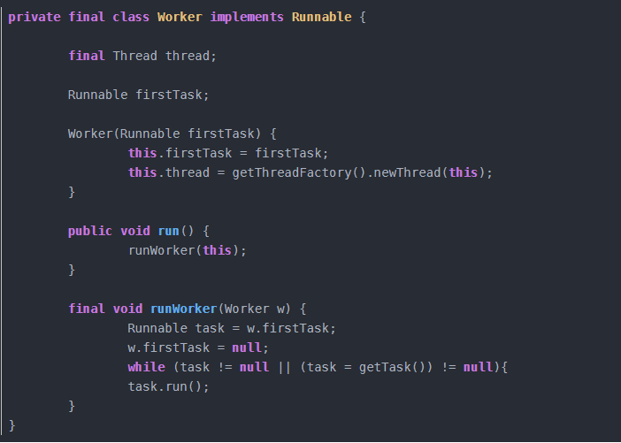

## 多线程、锁

### 线程池
* 线程池的好处  
1.资源利用率变高了  
2.提高了响应速度  
3.利于管理线程  
* 实现原理（线程复用、管理线程）：  
线程复用原理：  
  
解释：线程池中有几个工作类：本身是一个runnable，内部还有一个线程，启动线程也就是启动了本身；
worker的任务就是不断从队列里面拉去任务，然后执行任务的run方法，也就是说每一个worker就是串行执行任务。  
管理线程实现原理：  
在ThreadPoolExecutor有个ctl的AtomicInteger变量。通过这一个变量保存了两个内容：  
1.所有线程的数量  
2.每个线程所处的状态  
其中低29位存线程数，高3位存runState，通过位运算来得到不同的值。  
* 拒绝策略  
1.CallerRunsPolicy：线程调用运行该任务的 execute 本身  
2.AbortPolicy：处理程序遭到拒绝将抛出运行时 RejectedExecutionException  
3.DiscardPolicy：不能执行的任务将被删除，不报错  
4.DiscardOldestPolicy：工作队列头部的任务将被删除，然后重试加入此任务。
### 竞态条件（race condition）：  
是指设备或系统出现不恰当的执行时序，而得到不正确的结果。  
### 检测一个线程是否拥有锁  
在java.lang.Thread中有一个方法叫holdsLock(obj)，它返回true如果当且仅当当前线程拥有某个具体对象的锁。  
### 锁分类
* 悲观锁/乐观锁  
***悲观锁***：认为操作会有竞争，那么不管有没有，为了保险，直接加锁  
***乐观锁***：认为操作很少有竞争，那么就不加锁，大多用cas实现，如果失败就重试  
* 公平锁/非公平锁  
***公平锁***：公平锁则在于每次都是按照先后顺序来分配    
***非公平锁***：随机分配锁资源给一个等待线程  
* 独享锁/共享锁  
***独享锁***：单个线程独占  
***共享锁***：允许多个线程持有  
* 自旋锁/自适应自旋锁  
***自旋锁***：线程空等待，知道获得锁资源  
***自适应自旋锁***：自适应意味着自旋的时间不再固定了，而是由前一次在同一个锁上的自旋时间及锁的拥有者的状态来决定：如果在同一个锁对象上，自旋等待刚刚成功获得过锁，并且持有锁的线程正在运行中，那么虚拟机就会认为这次自旋也很有可能再次成功，进而它将允许自旋等待持续相对更长的时间，比如100个循环。
相反的，如果对于某个锁，自旋很少成功获得过，那在以后要获取这个锁时将可能减少自旋时间甚至省略自旋过程，以避免浪费处理器资源。  
* 偏向锁/轻量级锁/重量级锁  
***实现过程***：对象头数据含有mark word数据，有一个锁标志位（00轻量级、01偏向、10重量级）和可变数据结构  
***轻量级锁***：线程栈中建立一个mark word的副本，通过cas操作将锁的mark word复制过来，对象头的指针指向这个栈指针，标志位为00，
执行同步操作，释放锁就cas替换回去，如果失败，表示锁升级为10重量级锁。  
***偏向锁***：当锁对象第一次被线程请求的时候，mark word记录当前的线程id，如果以后还来，直接进，如果另外的线程请求，那么升级成轻量级锁。  
***重量级锁***：先获取锁，操作，最后释放锁  
### volatile关键字  
* 所标记的变量为唯一内容，每个工作内存要用到这个变量的时候，是最新的主内存变量，也就是说，这个变量的状态对所有线程都是透明的，
如果需要对该变量写操作，那么立即刷新会主内存。  
* 禁止指令重排序，内存屏障的机制  
### synchronized关键字和Lock的使用区别
* synchronized不支持超时放弃
* synchronized是不公平锁
* synchronized是原生java底层实现，而lock是一个并发类
### synchronized的锁
重量级锁：对应于操作系统的mutex互斥锁  
* 对象头信息中有关标志位 
* 锁升级过程
    * 偏向锁01 =\> 轻量级锁00
    * 轻量级锁00 =\> 重量级锁10

### AQS的实现原理
内部有一个volatile的state变量和一个双向链表（存线程队列）  
***上锁过程***：尝试请求，如果成功，那么执行，如果失败，加入队尾，如果是老二，那么自旋cas请求资源，
否则依次往前找到一个确实等待的线程，接在后面，之间的失效节点都丢了。  
***释放锁过程***：cas归还资源，唤醒下一个有效的等待线程，设置为head  
[AQS](https://github.com/1510460325/MultiThread/blob/master/README.md)
### 独占锁（ReentrantLock）的实现原理
和上述是一样的  
### 读写锁（ReentrantReadWriteLock）的实现原理
读锁、写锁共用一个同步器：低位存写锁，高位存读锁；  
关键是存储读写锁的数量、和读写锁重入的次数
### LinkedBlockingDeque实现原理
take和push为阻塞方法！  
内部有一个双向队列，一个全局锁和两个信号（空，满）  
当获取时如果没有，唤醒被满信号量阻塞的生产者，自己阻塞  
当添加的时候满了，唤醒被空信号量阻塞的消费者，自己阻塞  
* add 和 pop如果队列满了或者空了报错
* put 和 take如果队列满了或者空了报错阻塞线程  
### ConcurrentHashMap实现原理
* jdk1.7为分段锁，即把一个hashMap分成很多个小的HashMap那么每个锁管理一个小的hashMap，并发数就高了！  
* jdk1.8采用锁住当前槽位头节点，如果头结点为空，那么cas设置，如果失败，说明头结点有位置了，那么锁住，放心操作！  
* size的求法，在put的时候如果cas添加baseCount失败，那么hash一下采用cas加入到CounterCell的某一位置的值上，
求size的时候返回baseCount+CounterCell的求和结果。
* putIfAbsent方法：底层采用putVal(k,v,onlyAbsent = true)在插入的时候检测是否已经存在
### CountDownLatch闭锁(基于共享锁AQS)
当前的state代表的是剩余的阻碍，所以等于0才能往下   
* await方法：如果state=0继续访问，否则加入队列等待
* countDown方法：让state-1，并且唤醒队首自旋获取锁
### Semaphore（基于共享锁AQS）
当前的state代表的是剩余的资源，所以大于0才能往下  
* acquire方法：设置state减少，如果剩下的state大于0继续访问，否则加入队列等待
* release方法：让state+1，并且唤醒队首自旋获取锁