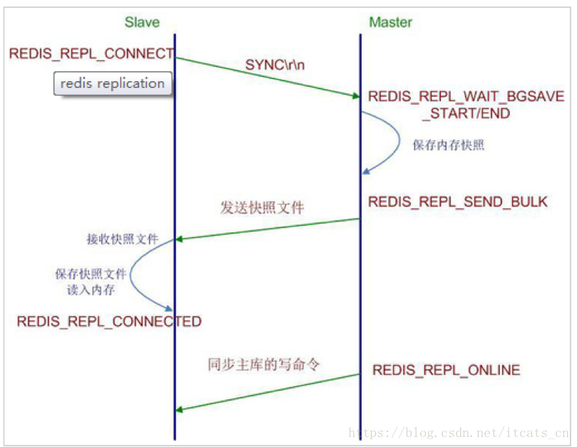
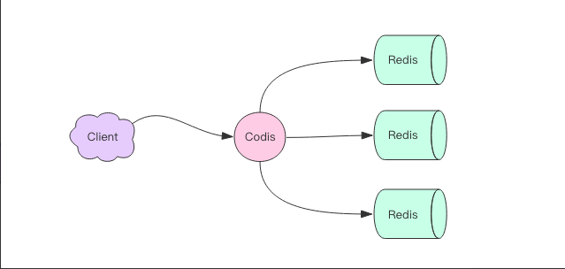
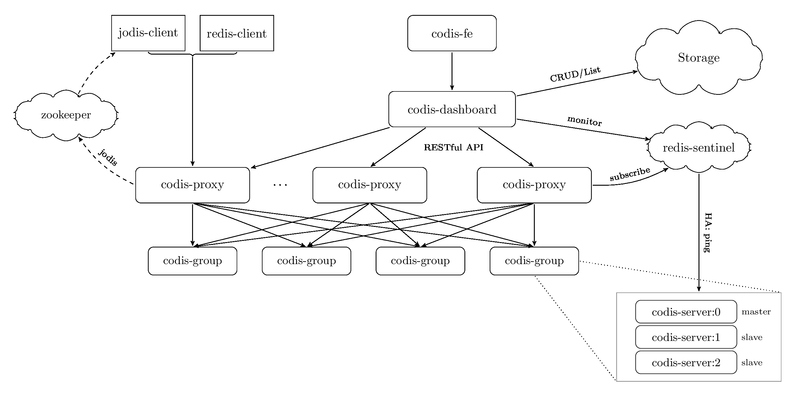

## redis知识点
### 5中数据结构(string, list, set, hash, zset)
* string： 字符串类型
* list：链表类型
* set：哈希表
* hash：字典（哈希表）
* zset：跳跃表实现
### redis持久化（RDB、AOF）
* RDB：把当前内存中的数据集快照写入磁盘，也就是 Snapshot 快照（数据库中所有键值对数据）。恢复时是将快照文件直接读到内存里。
* AOF：redis会将每一个收到的写命令都通过write函数追加到文件中(默认是 appendonly.aof)，当redis重启时会通过重新执行文件中保存的写命令来在内存中重建整个数据库的内容。
### zset的数据结构
跳跃表实现
### setnx实现分布式锁
加锁时只有一个线程能设置成功，其他线程设置失败自旋等待，解锁时删除该键。
### 相邻运行（不保证原子性）
jedis的事务，multi开启事务，最后执行操作。
### redis 主从复制
master不做任何配置，slave机器指定master  

* 同步：
    * 全量同步：从服务器主动请求主服务器，执行rbd操作，发回数据库快照，从服务器丢弃旧数据，载入新数据
    * 增量同步：全量同步之后，主服务器每执行一个写命令，就向从服务器发送执行新命令
### 哨兵机制 sentinel
* 监控(Monitoring): 哨兵(sentinel) 会不断地检查你的Master和Slave是否运作正常。
* 提醒(Notification):当被监控的某个Redis出现问题时, 哨兵(sentinel) 可以通过 API 向管理员或者其他应用程序发送通知。
* 自动故障迁移(Automatic failover):当一个Master不能正常工作时，哨兵(sentinel) 会开始一次自动故障迁移操作,它会将失效Master的其中一个Slave升级为新的Master, 并让失效Master的其他Slave改为复制新的Master; 当客户端试图连接失效的Master时,集群也会向客户端返回新Master的地址,使得集群可以使用Master代替失效Master。
### redis集群codis 大致实现原理
模型：  

* 分片：Codis会把所有的key分成1024个槽，这1024个槽对应着的就是Redis的集群，这个在Codis中是会在内存中维护着这1024个槽与Redis实例的映射关系。
~~~
//Codis中Key的算法
hash = crc32(command.key)
slot_index = hash % 1024
redis = slots[slot_index].redis
redis.do(command)
~~~
* Codis之间的槽位同步：基于zookeeper同步  

* 在迁移的时候，会在原来的Redis节点和新的Redis里都保存着迁移的槽位信息，在迁移的过程中，如果有key打进将要迁移或者正在迁移的旧槽位的时候，这个时候Codis的处理机制是，先是将这个key强制迁移到新的Redis节点中，然后再告诉Codis,下次如果有新的key的打在这个槽位中的话，那么转发到新的节点。
~~~
slot_index = crc32(command.key) % 1024
if slot_index in migrating_slots:
	do_migrate_key(command.key)  # 强制执行迁移
	redis = slots[slot_index].new_redis
else:
	redis = slots[slot_index].redis
redis.do(command)
~~~
* 容错机制：基于redis底层sentinel实现redis-server-group的自动切换  

## 《redis的设计与实现》读书笔记
### 1. SDS （simple dynamic string）简单动态字符串
~~~
struct sdshdr {
    int len; // 字符长度
    int free; // 空闲长度
    char buf[]; // 数据字符数组
};
~~~
相对于基本C语言字符串的优势：
* 获取长度的复杂度低
* 杜绝缓冲区的溢出、越界
* 减少修改字符串的内存重分配
* 二进制安全，可以存'\0'的二进制数据
* 兼容C字符串函数
