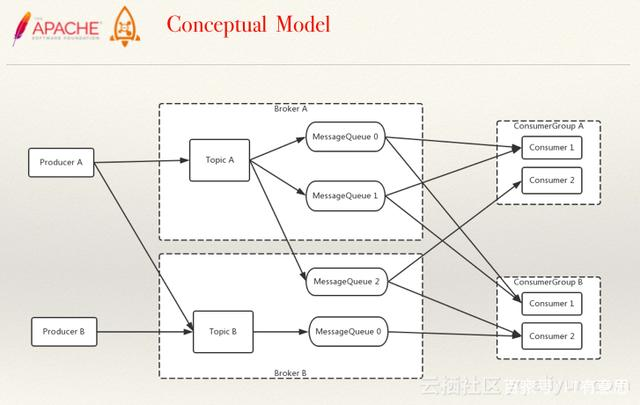
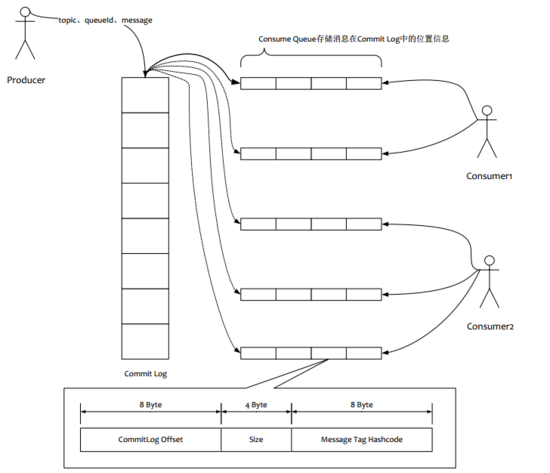

## rocketMQ
### 运行模型（kafka大同小异）
  
### 基本概念

在部署RocketMQ时，会部署两种角色:NameServer和Broker。
NameServer主要做路由服务。生产者发送消息时，首先向NameServer拿到Topic的路由信息，即这个Topic在哪些Broker上有。
Consumer也是一样，需要知道消费队列的路由情况。当然不是每次收发消息都去NameServer查询一遍，简单的说只有第一次初始化，和以后发送或者接收出现问题时需要查询一下。
### 储存结构

（1）消息主体以及元数据都存储在**CommitLog**当中  
（2）Consume Queue相当于kafka中的partition，是一个逻辑队列，存储了这个Queue在CommiLog中的起始offset，log大小和MessageTag的hashCode。  
（3）每次读取消息队列先读取consumerQueue,然后再通过consumerQueue去commitLog中拿到消息主体。  
### 主要文件
* CommitLog：消息存放物理文件，每台broker上的commitLog被本机器所有queue共享不做区分
* consume queue：消息的逻辑队列，相当于字典的目录用来指定消息在消息的真正的物理文件commitLog上的位置
## 源码解析：
### NameServer
#### 核心属性：RouteInfoManager
~~~
    HashMap<String/* topic */, List<QueueData>> topicQueueTable;
    HashMap<String/* brokerName */, BrokerData> brokerAddrTable;
    HashMap<String/* clusterName */, Set<String/* brokerName */>> clusterAddrTable;
    HashMap<String/* brokerAddr */, BrokerLiveInfo> brokerLiveTable;
    HashMap<String/* brokerAddr */, List<String>/* Filter Server */> filterServerTable;
~~~
* QueueData:topic的broker描述：包括broker名字，读写队列数
* BrokerData:broker集群：包括集群和一个broker地址列表
* BrokerLiveInfo：心跳更新信息，包括更新时间
#### 路由注册
broker启动时向所有NameServer发送一次心跳，之后每30s发送一次心跳包
#### 路由删除
NameServer每10s遍历一次brokerLiveTable，如果更新时间比较久，删除这个路由记录