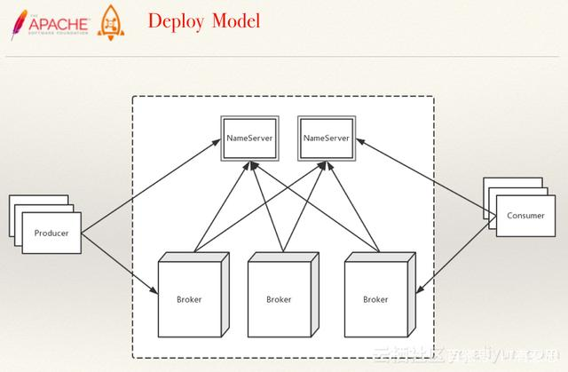

## rocketMQ
### 运行模型（kafka大同小异）
  
### 基本概念

在部署RocketMQ时，会部署两种角色:NameServer和Broker。
NameServer主要做路由服务。生产者发送消息时，首先向NameServer拿到Topic的路由信息，即这个Topic在哪些Broker上有。
Consumer也是一样，需要知道消费队列的路由情况。当然不是每次收发消息都去NameServer查询一遍，简单的说只有第一次初始化，和以后发送或者接收出现问题时需要查询一下。
### 储存结构

（1）消息主体以及元数据都存储在**CommitLog**当中  
（2）Consume Queue相当于kafka中的partition，是一个逻辑队列，存储了这个Queue在CommiLog中的起始offset，log大小和MessageTag的hashCode。  
（3）每次读取消息队列先读取consumerQueue,然后再通过consumerQueue去commitLog中拿到消息主体。  
### 主要文件
* CommitLog：消息存放物理文件，每台broker上的commitLog被本机器所有queue共享不做区分
* consume queue：消息的逻辑队列，相当于字典的目录用来指定消息在消息的真正的物理文件commitLog上的位置
## 源码解析：
### NameServer
#### 核心属性：RouteInfoManager
~~~
    HashMap<String/* topic */, List<QueueData>> topicQueueTable;
    HashMap<String/* brokerName */, BrokerData> brokerAddrTable;
    HashMap<String/* clusterName */, Set<String/* brokerName */>> clusterAddrTable;
    HashMap<String/* brokerAddr */, BrokerLiveInfo> brokerLiveTable;
    HashMap<String/* brokerAddr */, List<String>/* Filter Server */> filterServerTable;
~~~
* QueueData:topic的broker描述：包括broker名字，读写队列数
* BrokerData:broker集群：包括集群和一个broker地址列表
* BrokerLiveInfo：心跳更新信息，包括更新时间
#### 路由注册
注册的时候携带参数：
* final String clusterName,集群名字
* final String brokerAddr,broker地址IP:PORT
* final String brokerName,broker名字
* final long brokerId,brokerId，确定主从关系
* final String haServerAddr,
* final TopicConfigSerializeWrapper topicConfigWrapper,topic的元数据
* final List<String> filterServerList,过滤服务器列表
* final Channel channel，broker连接通道  

broker启动时向所有NameServer发送一次心跳，之后每30s发送一次心跳包.  
处理流程：
* 将broker加入到集群中
* 更新broker的主从列表
* 如果是master，创建或者更新topic元数据
* 创建topic的queue列表，也就是消息路由
* 更新存活broker表
* 注册broker过滤服务器列表
* 注册完成
#### 路由删除
NameServer每10s遍历一次brokerLiveTable，如果更新时间比较久，删除这个broker相关信息  
需要检查的信息：
* 删除存活broker列表
* 删除此broker的过滤服务器列表
* 删除该broker地址在brokerAddrTable的信息,brokerName的主从集群
* 删除这个broker在集群中的信息
* 删除brokerName相关topic路由信息
#### 路由发现
当topic路由发生变化的时候，nameServer不主动推送，而是客户端定时拉取主题最新的路由。  
流程：客户端会调用DefalutRequestProcessor的getRouteInfoByTopic方法  
方法流程：
* 填充List<QueueData>:从topicQueueTable中获取
* 填充List<BrokerData>：从brokerAddrData中获取
* 填充List<filterServer>：从filterServerTable中获取
### 生产者Producer
#### 概述：
生产者发送消息三种实现方式：
* 可靠同步发送：调用发送API阻塞，知道消息服务器响应发送结果
* 可靠异步发送：调用发送API后，同时给出异步回调函数，线程继续
* 单项发送：不管发送结果，线程继续
#### 消息发送
* 获取topic的路由信息：先从本地缓存表获取，如果没有就从NameServer获取，否则报错
~~~
ConcurrentMap<String/* topic */, TopicPublishInfo> topicPublishInfoTable
TopicPublishInfo:
    List<MessageQueue> messageQueueList:消息队列
    TopicRouteData topicRouteData:路由信息
        List<QueueData> queueDatas
        List<BrokerData> brokerDatas;broker地址信息
        HashMap<String/* brokerAddr */, List<String>/* Filter Server */> filterServerTable;
~~~
通过topic拿到TopicPublishInfo，核心属性TopicRouteData为消息路由信息，包括队列信息、broker信息
* 选择将要发送的消息队列：在消息队列中通过自增id进行下标轮询，并且避开上次发送失败的broker
~~~
public MessageQueue selectOneMessageQueue(final String lastBrokerName) {
        if (lastBrokerName == null) {
            return selectOneMessageQueue();
        } else {
            int index = this.sendWhichQueue.getAndIncrement();
            for (int i = 0; i < this.messageQueueList.size(); i++) {
                int pos = Math.abs(index++) % this.messageQueueList.size();
                if (pos < 0)
                    pos = 0;
                MessageQueue mq = this.messageQueueList.get(pos);
                //避开上次发送失败的broker
                if (!mq.getBrokerName().equals(lastBrokerName)) {
                    return mq;
                }
            }
            return selectOneMessageQueue();
        }
    }
    public MessageQueue selectOneMessageQueue() {
        int index = this.sendWhichQueue.getAndIncrement();
        int pos = Math.abs(index) % this.messageQueueList.size();
        if (pos < 0)
            pos = 0;
        return this.messageQueueList.get(pos);
    }
~~~
* 发送消息：
    * 拿到上一步选择的消息队列的broker地址，如果地址缺失，主动向NameServer更新
    * 为消息分配唯一id，如果消息内容过长则压缩
    * 构建发送请求包：生产者组、主题名称、队列数、队列id、发送时间、重试次数等
    * 发送数据
### 消息存储
#### 主要存储文件
* Commitlog文件:所有发送到此broker的消息全都顺序得存储在这个文件中
* ConsumerQueue文件:消息消费队列,消息存到Commitlog之后会异步发送到消息队列
* indexFile文件:消息索引文件，存储消息key->offset的对应关系
#### MappedFile
位于CommitLog下方，是最终保存消息的地方，当文件长度达到限制是新建文件，
名字为第一个消息的全局偏移量，由于文件会删除，所以通过offset获取mappedFIle算法：
(int)(offset/mappedFIleSize - fromOffset/mappedFIleSize)
#### 消息发送存储过程
* 检验目标broker的合法性、消息的长度限制
* 获取commitLog
* 申请写锁
* 调用commitLog的putMessage方法
* 查找mapperFile没有就创建一个
* 追加消息到mapperFile中，如果此mapperFile满了，新建一个mapperFile并设置position指针
* 为消息分配一个全局唯一消息id
* 更新消息偏移量
* 释放写锁
* 进行信息刷盘，也就是说上述的消息全部存到内存中的MappedFileQueue中
#### MappedFileQueue
管理MappedFile文件，有如下属性：
* storePath：存储目录，也就是commitLog的目录
* mappedFileSize：单个文件的限制
* mappedFiles：list文件列表
* flushedWhere ：刷盘指针，本地文件保存消息指针
* committedWhere ：当前提交消息指针，内存中的写指针
#### MappedFile
存储消息，属性：
* wrotePosition：写指针，从0开始
* committedPosition：提交指针
* flushedPosition：刷盘指针
* fileChannel：文件通道
* writeBuffer：内存buffer

大致操作：
* 提交操作：将写指针和提交指针间的数据写入到内存buffer中
* 刷盘操作：将内存buffer的数据刷到磁盘中（通过FileChannel）
#### ConsumerQueue
保存消息队列，相当于commitLog的索引文件，供消费者消费，只保存该topic在commitLog中的offset、长度size、tag-hashcode，
一共20个字节
#### indexFile